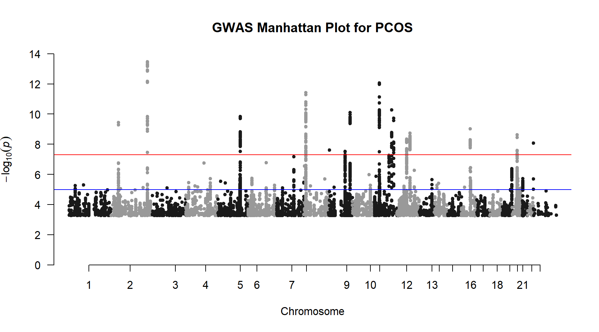

# Genome-Wide Association Study (GWAS) Analysis of Polycystic Ovary Syndrome (PCOS)

## Project Overview

Polycystic ovary syndrome (PCOS) is a complex endocrine and reproductive disorder influenced by multiple genetic and environmental factors. Genome-wide association studies (GWAS) have identified multiple genetic loci contributing to PCOS susceptibility.

The aim of this project was to analyse publicly available GWAS summary statistics to identify genomic regions associated with PCOS and investigate their biological relevance.

The main biological question addressed was:

**Which genomic regions contain genetic variants significantly associated with PCOS, and what biological insights can be gained from these associated loci?**

This project demonstrates a typical GWAS analysis workflow, including:

- Summary statistics processing
- Data quality assessment
- Genome-wide significance evaluation
- Manhattan plot visualisation
- Significant variant prioritisation
- Genomic region investigation
- Comparison with previously reported PCOS-associated loci

---

# Dataset

The GWAS summary statistics used in this analysis were obtained from the GWAS Catalog.

## GWAS Study Information

**Study accession:** GCST007089

**Study title:**  
Large-scale genome-wide meta-analysis of polycystic ovary syndrome suggests shared genetic architecture for different diagnosis criteria

**Publication:**  
Day et al., 2018, PLoS Genetics

**Trait:**  
Polycystic ovary syndrome

## Study Population

The original GWAS included:

- 10,074 PCOS cases of European ancestry
- 103,164 controls of European ancestry
- Total sample size: 113,238 individuals

The study used genome-wide genotyping arrays with imputed SNP data.

---

# Tools and Technologies

## Programming Language

- R

## Analysis Environment

- RStudio

## Databases and Annotation Resources

- GWAS Catalog
- Ensembl Genome Browser

## R Packages

- data.table
- qqman
- ggplot2

---

# GWAS Summary Statistics

The downloaded summary statistics contained the top 10,000 SNP associations from the GWAS study.

The dataset contained the following columns:

| Column | Description |
|---|---|
| MarkerName | Variant genomic position identifier |
| Allele1 | Effect allele |
| Allele2 | Alternative allele |
| Freq1 | Effect allele frequency |
| Effect | Estimated genetic effect |
| StdErr | Standard error of effect estimate |
| Pvalue | Association p-value |
| HetPVal | Heterogeneity p-value |
| TotalSampleSize | Total GWAS sample size |
| EffSampleSize | Effective sample size |
| chr | Chromosome |
| pos | Genomic position |

A key observation was that the extracted dataset contained positional variant identifiers rather than rsIDs.

Example: 2:213391766 2:213391750 2:213391696

This affected downstream functional annotation because direct rsID-based variant lookup was not possible.

---

# Data Quality Assessment

The dataset was assessed before downstream analysis.

Quality checks performed:

- Dataset structure inspection
- Missing value assessment
- Duplicate marker identification
- Summary statistics evaluation
- P-value distribution assessment

Results:

- No missing values were detected.
- No duplicate marker positions were identified.
- The dataset contained 10,000 unique variant markers.

---

# Genome-wide Significance Threshold

GWAS significance was evaluated using the conventional threshold: P-value < 5 × 10⁻⁸

Variants passing this threshold were considered statistically significant genome-wide associations.

---

# Manhattan Plot

A Manhattan plot was generated to visualise the distribution of association signals across chromosomes.

The Manhattan plot demonstrated significant association signals across multiple chromosomes, supporting the polygenic architecture of PCOS.

A particularly strong association peak was observed on chromosome 2.

---

# Significant Variant Prioritisation

The strongest associations were ranked according to p-value.

The top associated variant identified was:

| Variant | Chromosome | Position | P-value | Effect |
|---|---|---|---|---|
| 2:213391766 | 2 | 213391766 | 3.344 × 10⁻¹⁴ | 0.1663 |

The top 20 SNPs showed strong clustering within: Chromosome 2: 213384298–213399917 (GRCh38)

The close genomic proximity of these variants suggests that they may represent a shared association signal within a linkage disequilibrium (LD) region rather than 20 independent causal variants.

---

# Genomic Region Investigation and Variant Interpretation

Because the extracted summary statistics contained positional markers rather than rsIDs, direct variant annotation was limited.

The strongest association region was investigated using the Ensembl Genome Browser (GRCh38).

The region contained genes and regulatory transcripts including:

| Annotation | Type |
|---|---|
| SPAG16 | Protein-coding gene |
| LINC01953 | Long non-coding RNA |
| MIR4438 | microRNA |
| SPAG16-DT | Long non-coding RNA |
| MIR4776-1 / MIR4776-2 | microRNA transcripts |

These annotations indicate that the strongest PCOS association signal identified in this analysis occurs within a genomic region containing SPAG16 and surrounding regulatory elements.

However, further fine-mapping would be required to determine whether the association is driven by SPAG16, another nearby gene, or regulatory elements within this locus.

---

# Comparison With Previously Reported PCOS GWAS Findings

To understand how the identified association signal relates to established PCOS genetics, previously reported PCOS-associated variants from the GWAS Catalog were reviewed.

The purpose of this comparison was **not to assume that these variants were identical to the top SNPs identified in this analysis**, but to evaluate whether the identified chromosome regions overlap with known PCOS genetic architecture.

Previously reported PCOS-associated loci include:

| Gene | Reported SNP | Chromosome Position | Biological relevance |
|---|---|---|---|
| THADA | rs7563201 | Chr2:43,334,641 | Associated with PCOS susceptibility. THADA has been linked to metabolic regulation and pathways relevant to insulin-related traits. |
| ERBB4 | rs2178575 | Chr2:212,527,042 | Encodes a receptor tyrosine kinase involved in cellular signalling and reproductive biology. |
| IRF1 / CARINH | rs13164856 | Chr5:132,477,512 | Involved in transcriptional regulation and immune-related pathways. |
| GATA4 | rs804279 | Chr8:11,766,380 | Important transcription factor involved in ovarian development and reproductive tissue function. |
| DENND1A | rs9696009 | Chr9:123,856,954 | One of the strongest established PCOS susceptibility genes; involved in androgen biosynthesis and ovarian steroidogenesis. |
| YAP1 | rs11225154 | Chr11:102,172,509 | Regulates cellular signalling and growth pathways. |
| ERBB3 | rs2271194 | Chr12:56,083,910 | Involved in growth factor signalling. |
| TOX3 / CASC22 | rs8043701 | Chr16:52,341,865 | Associated with transcriptional regulation. |
| MAPRE1 | rs853854 | Chr20:32,832,951 | Involved in microtubule organisation and cellular processes. |

---

# Interpretation of GWAS Comparison

The strongest signal identified in this project occurred on chromosome 2.

Interestingly, previous PCOS GWAS studies have also identified important PCOS-associated loci on chromosome 2, including:

- THADA
- ERBB4

However, the exact variants identified in this analysis were different from the reported lead SNPs in the GWAS Catalog.

This highlights an important concept in GWAS interpretation:

- Multiple SNPs can exist within the same genomic region.
- Published studies often report representative lead SNPs.
- The strongest statistical SNP from summary statistics is not always the same as the published lead variant.

Therefore, the chromosome 2 association identified in this project represents a strong PCOS-associated genomic signal, while further fine-mapping and LD analysis would be required to determine the precise causal variant.

---

# Why a QQ Plot Was Not Included

QQ plots are commonly used in GWAS quality control to compare observed p-values against expected p-values under the null hypothesis.

However, this analysis used only the top 10,000 SNPs from the summary statistics rather than the complete genome-wide dataset containing all tested variants, including non-significant variants.

Because the dataset was enriched for significant associations, a QQ plot would not accurately assess genomic inflation or systematic bias.

Therefore, a QQ plot was not included.

---

# Biological Significance

This analysis supports the polygenic nature of PCOS by identifying multiple association signals across the genome.

The strongest association region was located on chromosome 2, highlighting a genomic region potentially involved in PCOS susceptibility.

Integration with previous GWAS findings demonstrates that chromosome 2 contains biologically relevant PCOS-associated loci, while additional functional studies are required to determine the mechanisms linking these regions to disease development.

---

# Limitations

- Only the top 10,000 SNPs were analysed rather than the complete GWAS summary statistics.
- Variant identifiers were positional markers rather than rsIDs, limiting direct functional annotation.
- The dataset represented mainly European ancestry populations, limiting generalisation across global populations.
- GWAS association does not prove causality.
- Additional LD analysis and functional validation are required.

---

# Future Improvements

Future extensions of this project could include:

- Obtaining complete GWAS summary statistics
- Mapping variants using rsIDs
- Performing LD analysis
- Fine-mapping associated loci
- Integrating eQTL datasets
- Performing functional enrichment analysis
- Investigating ancestry-specific genetic architecture, including African population datasets

---

# Conclusion

This project demonstrates a complete GWAS analysis workflow, from summary statistics processing to biological interpretation.

The analysis identified a strong PCOS-associated locus on chromosome 2 and demonstrated the importance of distinguishing between statistical association signals, published GWAS lead variants, and functional gene interpretation.

By integrating GWAS results with genomic annotation and previous literature, this project provides a reproducible approach for understanding the genetic architecture of PCOS.
